# 우분투 가상환경 설치

### 1. 관련 파일 다운로드
   - VirtualBox
   - VirtualBox Extension
   - Ubuntu Server 22.04 LTS

### 2. VirtualBox 설치

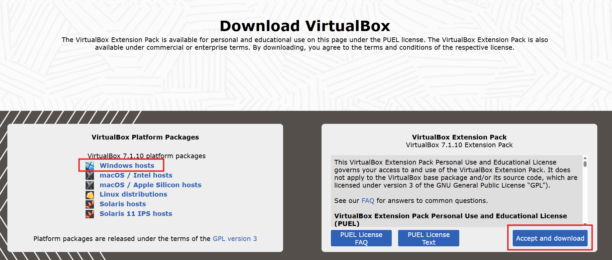

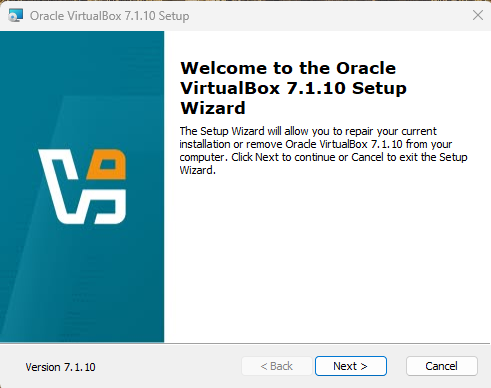

`관리자 권한으로 실행`

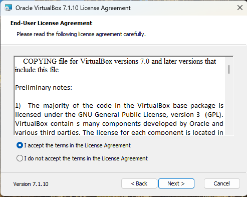
`Next`

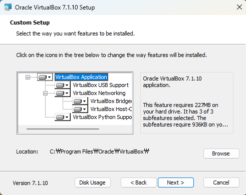
`Next`

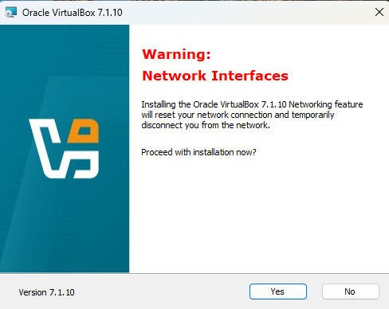
`Yes`

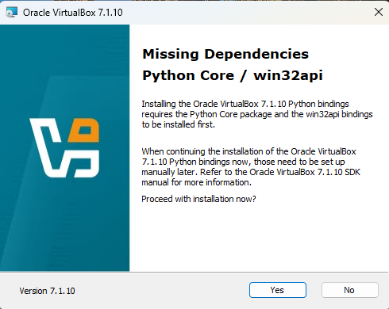
`Yes`

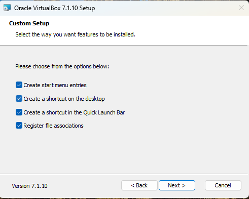
`Next`

`Install`

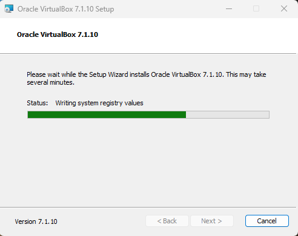

`Finish`

### 3. VirtualBox Extension 설치

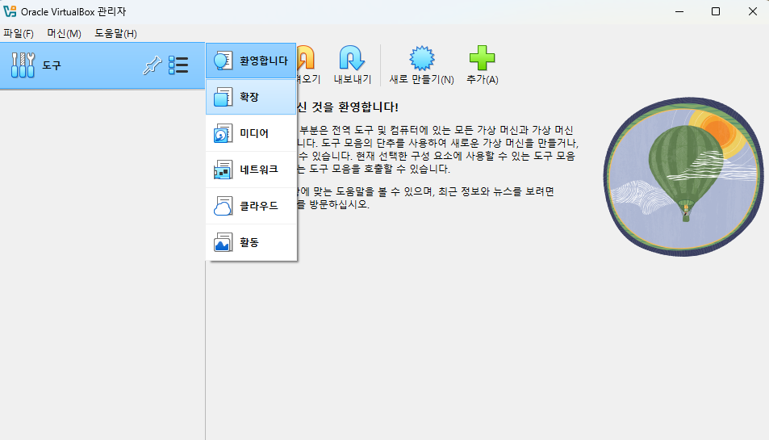

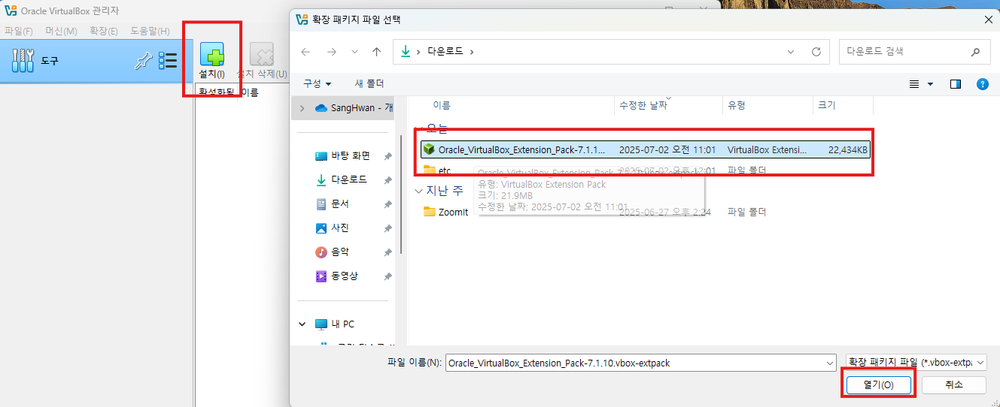

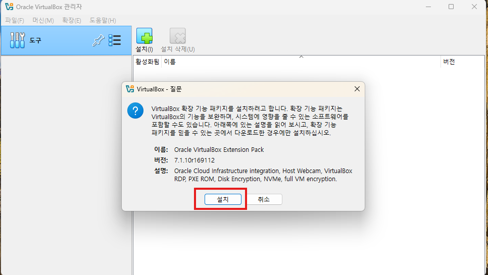

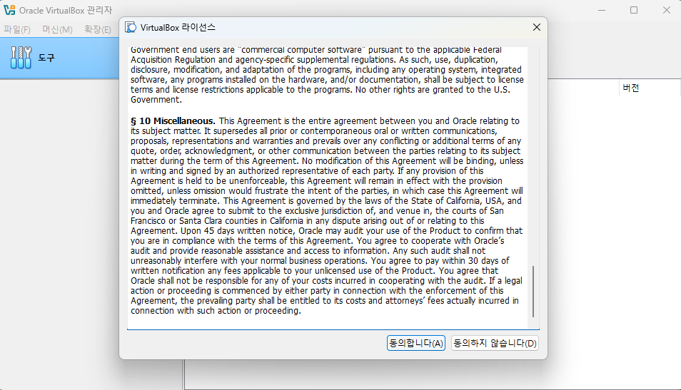

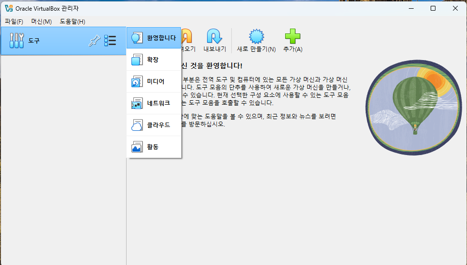

