# 우분투 가상환경 설치

### 1. 관련 파일 다운로드
   - VirtualBox
   - VirtualBox Extension
   - Ubuntu Server 22.04 LTS

### 2. VirtualBox 설치


`관리자 권한으로 실행`


`Next`


`Next`


`Yes`


`Yes`


`Next`


`Install`


`Finish`


### 3. VirtualBox Extension 설치


### 4. Ubuntu-Server 22.04 LTS 설치하기

 `새로 만들기`


```
이름 : Ubuntu-Server-01
폴더 : D:\VirtualBoxVMs (용량이 넉넉한 드라이브 선택, C로 Default로 해도 됨)
에서 받은 이미지 사용
ISO 이미지 다운로드 : Ubuntu-Server 22.04 LTS
```
[ISO 이미지 다운로드](https://releases.ubuntu.com/22.04/?_ga=2.149898549.2084151835.1707729318-1126754318.1683186906&_gl=1*8pscxl*_gcl_au*MTAwNzMzOTExMy4xNzUxNDIyMDQw)


`완료`


`시작`


```키보드 선택 
   Tab을 누르면 이동한다
   Enter를 누르고 Korean을 선택한다.
   Tab을 눌러서 Done으로 이동후 Enter
```

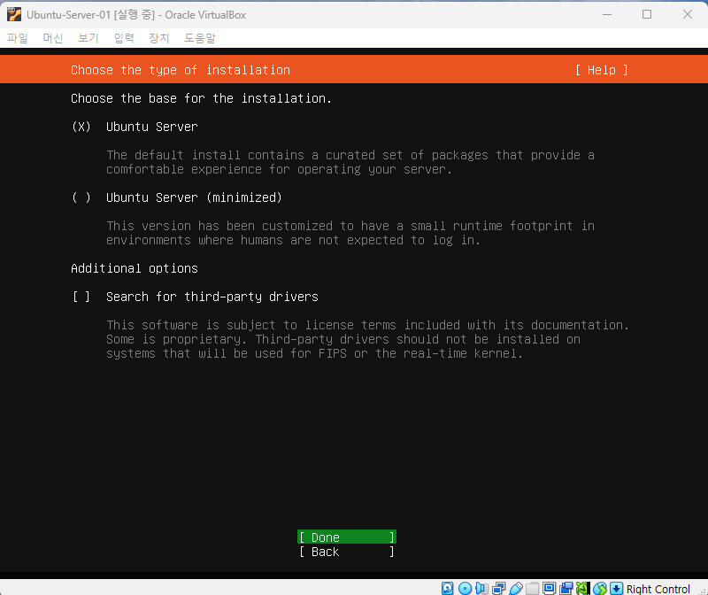

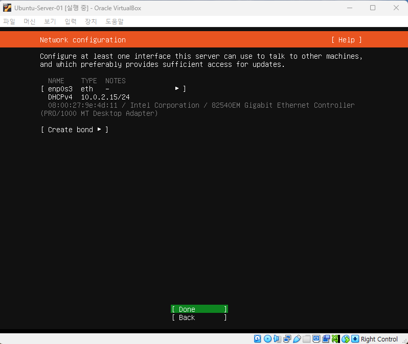


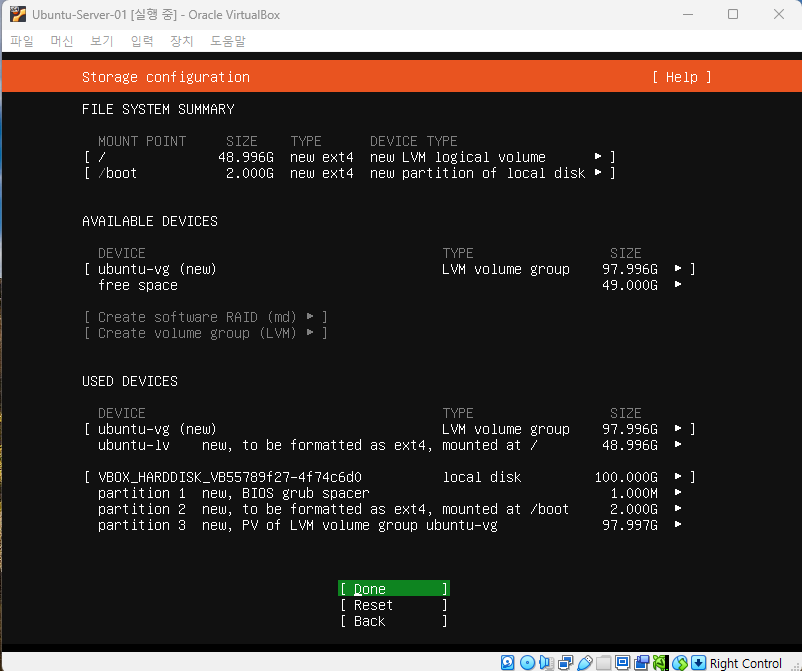


```
Your name : pikachu
Your servers name : myserver01
Pick a username : eevee
password : 1234
```


```
   Space를 눌러서
   Install OpenSSH server를 선택한다.
```


`설치 중`


`Reboot Now`


`Enter`


`로그인'

```
eevee
1234
```


```
pwd 현재 경로
hostname (현재 서버의)네트워크 상의 이름
```


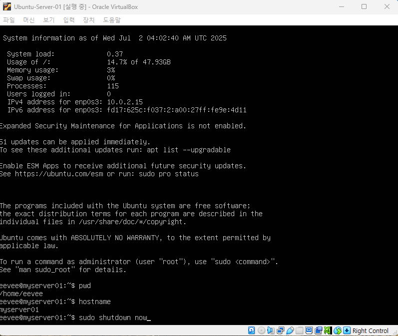

`sudo shutdown now 명령으로 종료`


### 5. VirtualBox로 SnapShot 만들기


```스냅샷은 현재 상태를 저장해놓는다.
   실습이 잘못되어도 언제든지 복원할 수 있다.
```


### 6. NAT 네트워크 설정하기


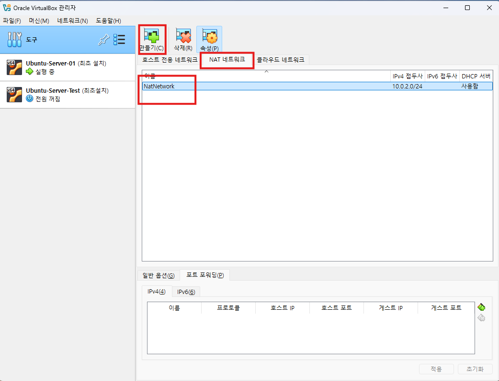


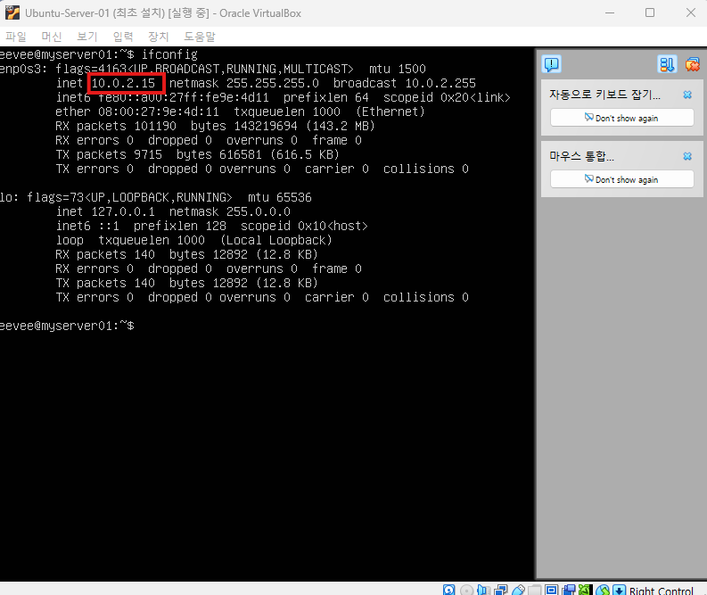


### 7. VSCode로 터미널 연결하기


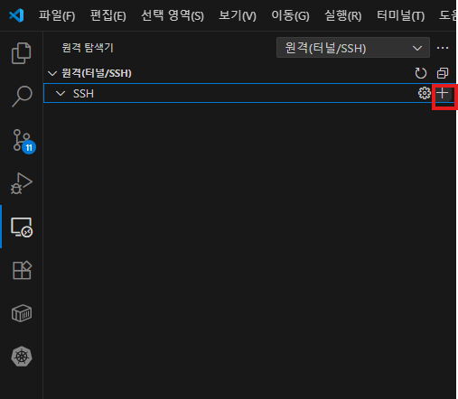


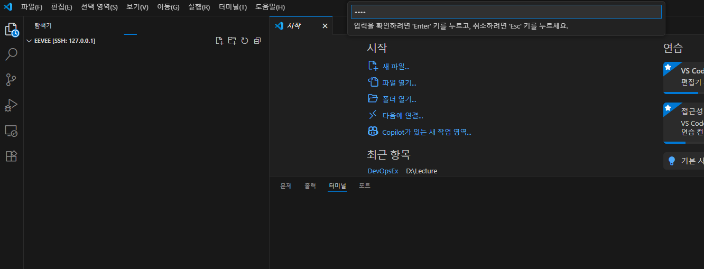


### 8. MobaXterm으로 터미널 연결하기

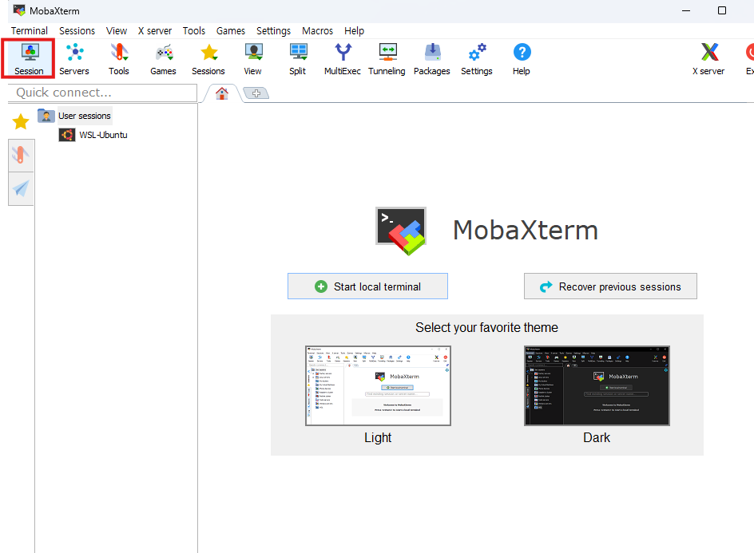


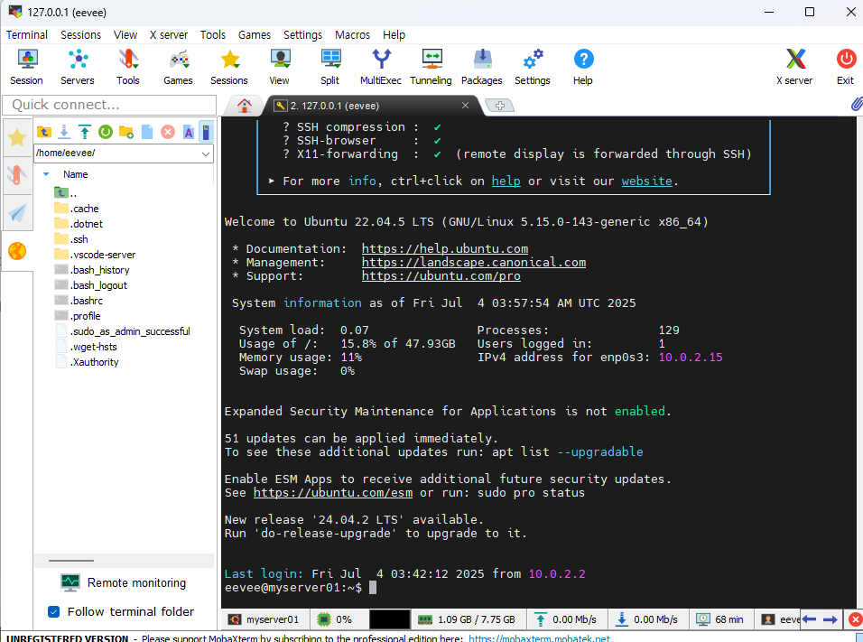


### 9. VSCode로 key로 연결하기(암호 없어도 됨)


```
ssh-keygen -t rsa -b 4096 -C "your_email@example.com"
```


### 10. MobaXterm에서 id_rsa로 연결하기


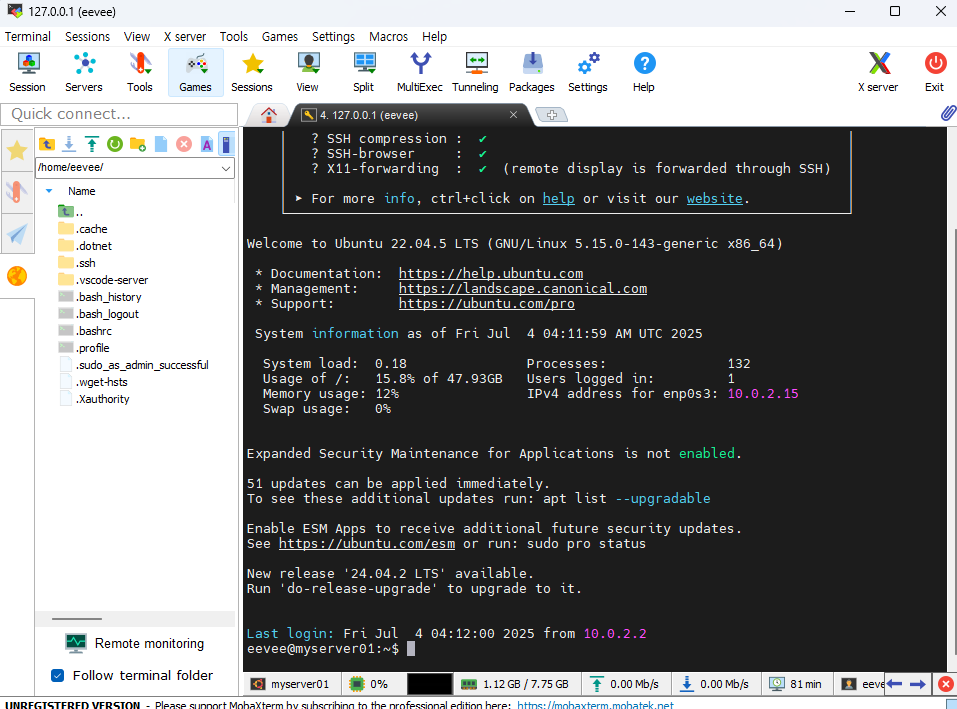


